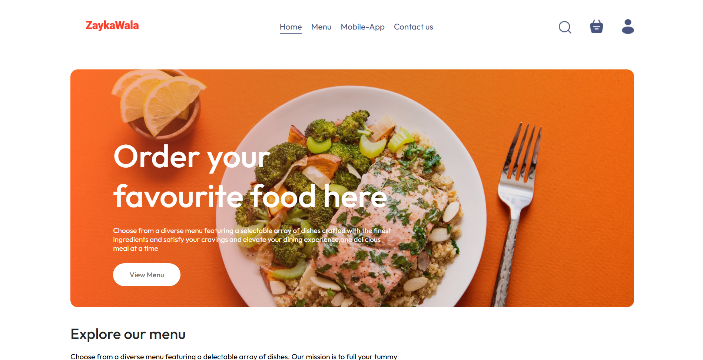
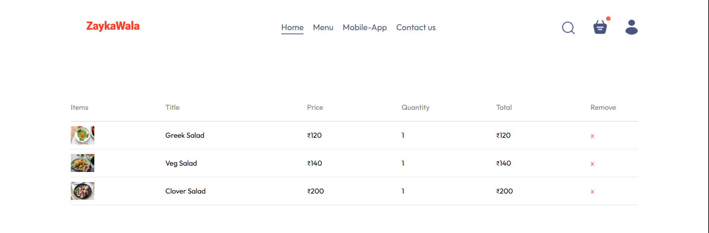
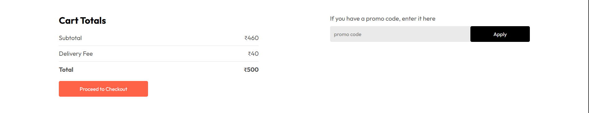
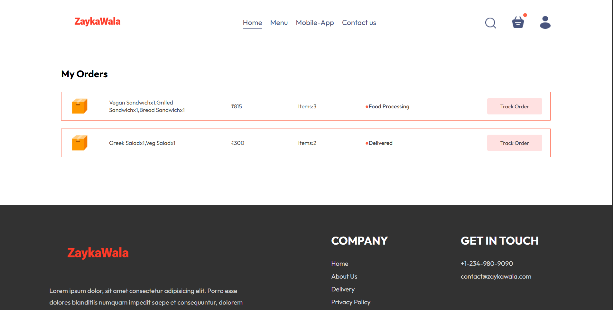
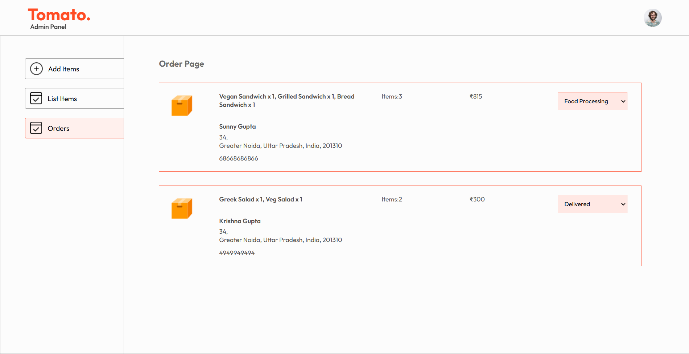

````markdown
# 🍽️ Zaykawala - Food Delivery Website

A modern and responsive full-stack food delivery web application where users can browse delicious meals, add items to their cart, place orders securely, and manage their orders with an intuitive user interface.

## 🚀 Features

### 👤 User Features
- Browse food items by category
- Search and explore the menu
- Add and remove items from the cart
- Secure user authentication
- Online payment integration
- Place orders
- View order history
- Fully responsive design

### 🛠️ Admin Features
- Admin Dashboard
- Add new food items
- Remove food items
- Upload food images
- Manage customer orders
- Update order status

---

## 🧰 Tech Stack

### Frontend
- React.js
- React Router
- Axios
- CSS
- React Toastify

### Backend
- Node.js
- Express.js

### Database
- MongoDB
- Mongoose

### Payment
- Stripe

---

## ⚙️ Installation

### Clone the repository

```bash
git clone https://github.com/your-username/your-repository.git
```

### Navigate to the project

```bash
cd FoodDelivery
```

### Install dependencies

#### Frontend

```bash
cd frontend
npm install
```

#### Backend

```bash
cd ../backend
npm install
```

#### Admin

```bash
cd ../admin
npm install
```

---

## ▶️ Run the Project

### Backend

```bash
npm run server
```

### Frontend

```bash
npm run dev
```

### Admin Panel

```bash
npm run dev
```

---

# 📸 Screenshot Preview

| Home Page | Menu |
|-----------|------|
|  |  |

| Cart | Checkout |
|------|----------|
|  |  |

| My Orders | Admin Dashboard |
|-----------|-----------------|
|  |  |


---


---


---

## 📄 License

This project is licensed under the MIT License.

---

## 👨‍💻 Developer

**Krishna**

Third-Year Computer Science Engineering Student

Passionate about building full-stack web applications using the MERN Stack.

⭐ If you found this project helpful, consider giving it a **Star** on GitHub!
````

